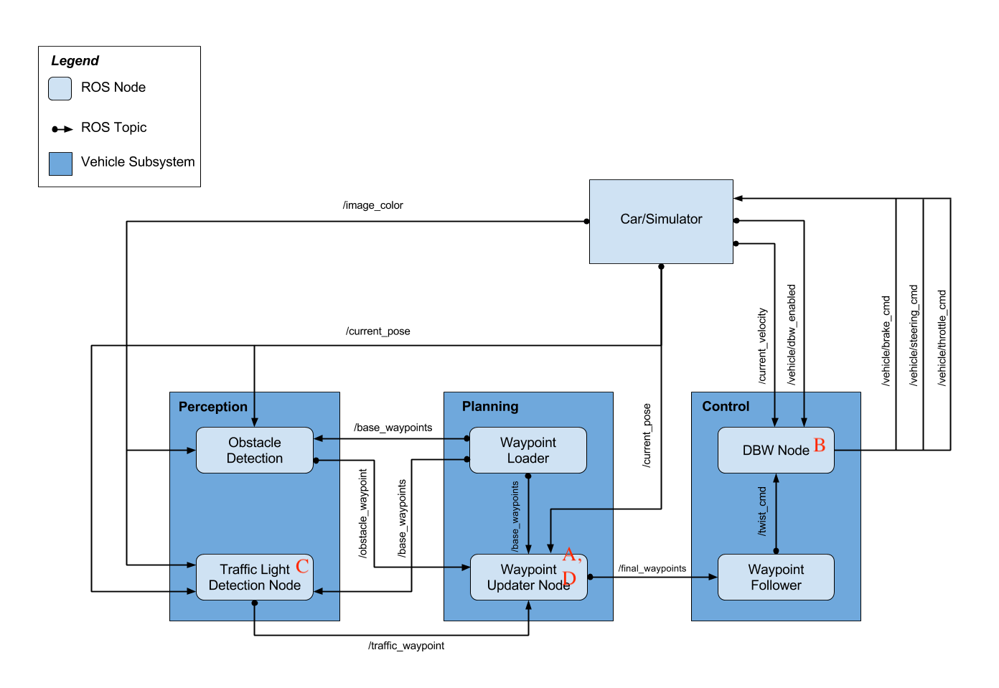
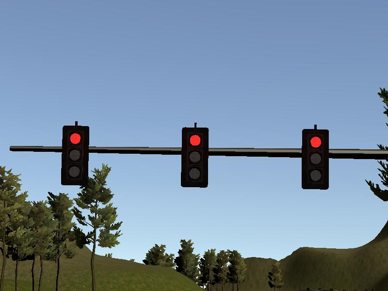
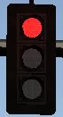

# Udacity Self-Driving Car Engineer Nanodegree
# System Integration Project


## Introduction

The target here is to integrate the various systems and modules (traffic light perception, waypoint planing and command control module) of a self driving car in order to drive a car in a simulator and even a real car (Udacity Carla). 

In the simulator, the car should smoothly follow the predefined waypoints, pause before red light and rerun upon traffic light turns green without big (>10) acceleration and jerk.

## Detail
 
The image below is the ROS system architecture disgram of the autonomous vehicle system. The modules we need to finish are marked using 'A,B,C,D', which is also the order of our completing the project.





### A. Waypoint Updater Node (Partial):

 Complete a partial waypoint updater which subscribes to /base_waypoints and /current_pose and publishes to /final_waypoints.
 
### B. DBW Node
 Once the waypoint updater is publishing /final_waypoints, the waypoint_follower node will start publishing messages to the/twist_cmd topic. At this point, you have everything needed to build the dbw_node. 
 
 A pid controller with tuned parameters in DBW node is responsible for mapping target location and speed to the commands of brake, steering and throttle.
 
 Now the car should drive in the simulator, but still without considering the traffic lights (assuming all lights are green). 

### C. Traffic Light Detection

   Detection: Detect the traffic light and its color from the /image_color. We use a pretrained model (model "ssd_mobilenet_v1_coco" from [https://github.com/tensorflow/models/blob/master/research/object_detection/g3doc/detection_model_zoo.md](https://github.com/tensorflow/models/blob/master/research/object_detection/g3doc/detection_model_zoo.md)) to detect traffic light bounding boxes and apply rgb thresholding to classify a light is red or not.
   
   
 
an example of /image_color, showing what does car see.
		
 

an example of a bounding box (output of tensorflow model), showing a red traffic light.

 

an example of cv2 thresholding effict.
   
   Waypoint publishing: Once you have correctly identified the traffic light and determined its position, you can convert it to a waypoint index and publish it.


### D. Waypoint Updater (Full)

Waypoint Updater (Full): Use /traffic_waypoint to change the waypoint target velocities before publishing to /final_waypoints. 

Now the car should now stop at red traffic lights and move when they are green.


## Conclusion

As this project is individual work, it is such a good chance to get familiar with different key components (perception, planning and control) and the final performance is acceptable (smoothly driving in lane, pase and rerun in time). 

However due to the poor computational power of virtual machine and communication latency between simulator and program, the car shows its response somehow slow, for example, when a traffic light has turned green from red for a short while, the car can move. 

### Original Readme

* Be sure that your workstation is running Ubuntu 16.04 Xenial Xerus or Ubuntu 14.04 Trusty Tahir. [Ubuntu downloads can be found here](https://www.ubuntu.com/download/desktop).
* If using a Virtual Machine to install Ubuntu, use the following configuration as minimum:
  * 2 CPU
  * 2 GB system memory
  * 25 GB of free hard drive space

  The Udacity provided virtual machine has ROS and Dataspeed DBW already installed, so you can skip the next two steps if you are using this.

* Follow these instructions to install ROS
  * [ROS Kinetic](http://wiki.ros.org/kinetic/Installation/Ubuntu) if you have Ubuntu 16.04.
  * [ROS Indigo](http://wiki.ros.org/indigo/Installation/Ubuntu) if you have Ubuntu 14.04.
* [Dataspeed DBW](https://bitbucket.org/DataspeedInc/dbw_mkz_ros)
  * Use this option to install the SDK on a workstation that already has ROS installed: [One Line SDK Install (binary)](https://bitbucket.org/DataspeedInc/dbw_mkz_ros/src/81e63fcc335d7b64139d7482017d6a97b405e250/ROS_SETUP.md?fileviewer=file-view-default)
* Download the [Udacity Simulator](https://github.com/udacity/CarND-Capstone/releases).

### Docker Installation
[Install Docker](https://docs.docker.com/engine/installation/)

Build the docker container
```bash
docker build . -t capstone
```

Run the docker file
```bash
docker run -p 4567:4567 -v $PWD:/capstone -v /tmp/log:/root/.ros/ --rm -it capstone
```

### Usage

1. Clone the project repository
```bash
git clone https://github.com/udacity/CarND-Capstone.git
```

2. Install python dependencies
```bash
cd CarND-Capstone
pip install -r requirements.txt
```
3. Make and run styx
```bash
cd ros
catkin_make
source devel/setup.sh
roslaunch launch/styx.launch
```
4. Run the simulator

### Real world testing
1. Download [training bag](https://drive.google.com/file/d/0B2_h37bMVw3iYkdJTlRSUlJIamM/view?usp=sharing) that was recorded on the Udacity self-driving car (a bag demonstraing the correct predictions in autonomous mode can be found [here](https://drive.google.com/open?id=0B2_h37bMVw3iT0ZEdlF4N01QbHc))
2. Unzip the file
```bash
unzip traffic_light_bag_files.zip
```
3. Play the bag file
```bash
rosbag play -l traffic_light_bag_files/loop_with_traffic_light.bag
```
4. Launch your project in site mode
```bash
cd CarND-Capstone/ros
roslaunch launch/site.launch
```
5. Confirm that traffic light detection works on real life images
